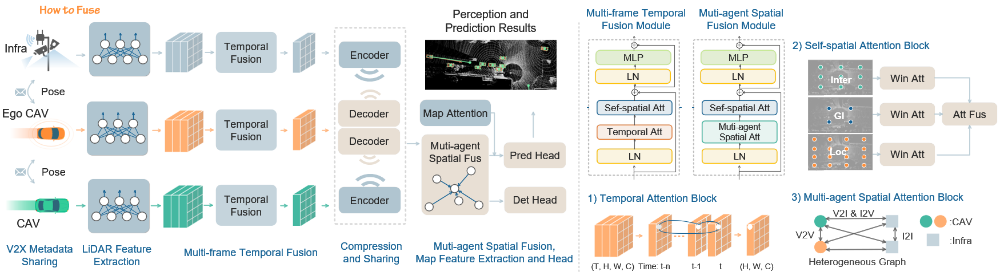
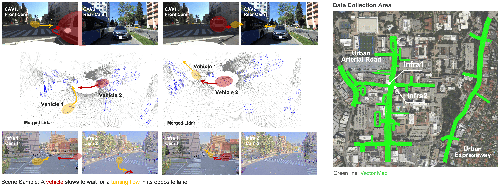

# V2XPnP: Vehicle-to-Everything Spatio-Temporal Fusion for Multi-Agent Perception and Prediction

[](https://mobility-lab.seas.ucla.edu/v2xpnp/)
[](https://arxiv.org/abs/2412.01812)
[](https://arxiv.org/abs/2412.01812)
[](https://drive.google.com/drive/folders/1ZjVW-OKu-afIoiqfQJgFYwHOWzWE8_e8?usp=sharing)
<!-- [](https://creativecommons.org/licenses/by-nc-nd/4.0/) -->

This is the official implementation of "V2XPnP: Vehicle-to-Everything Spatio-Temporal Fusion for Multi-Agent Perception and Prediction", [Zewei Zhou](https://scholar.google.com/citations?user=TzhyHbYAAAAJ&hl=zh-CN&oi=ao), [Hao Xiang](https://xhwind.github.io/), [Zhaoliang Zheng](https://scholar.google.com/citations?user=SyR4O7YAAAAJ&hl=en), [Seth Z. Zhao](https://sethzhao506.github.io/), [Mingyue Lei](https://www.linkedin.com/in/%E6%98%8E%E6%9C%88-%E9%9B%B7-9029611a0/), [Yun Zhang](https://handsomeyun.github.io/), [Tianhui Cai](https://scholar.google.com/citations?user=6YqkXM0AAAAJ&hl=zh-CN&oi=ao),
[Xinyi Liu](https://scholar.google.com/citations?user=ikSFIk0AAAAJ&hl=zh-CN), [Johnson Liu](), [Maheswari Bajji](), [Jacob Pham](), [Xin Xia](https://scholar.google.com/citations?user=vCYqMTIAAAAJ&hl=en), [Zhiyu Huang](https://mczhi.github.io/), [Bolei Zhou](https://boleizhou.github.io/), [Jiaqi Ma](https://mobility-lab.seas.ucla.edu/about/)



V2XPnP is the first open-source V2X spatio-temporal fusion framework for cooperative perception and prediction. This framework combines the intermediate fusion strategy and one-step communication and integrates diverse attention fusion modules in the unified Transformer architecture for V2X spatial-temporal information.

<div style="display: flex; justify-content: center; align-items: center; width: 100%; height: auto;">
    
</div>

V2XPnP Sequential Dataset is the first large-scale, real-world V2X sequential dataset featuring multiple agents and all V2X collaboration modes, ie, vehicle-to-vehicle (V2V), infrastructure-to-infrastructure (I2I), vehicle-centric (VC), and infrastructure-centric (IC).

## Release Plan
- **`2024/06`**: Sample Data of V2XPnP 
- **`2025/03`**: Whole V2XPnP Dataset
- **`2025/03`**: V2XPnP Codebase - Official Version 1.0


## Data
The sample data of V2XPnP Sequential Dataset can be accessed in [Google Drive](https://drive.google.com/drive/folders/1ZjVW-OKu-afIoiqfQJgFYwHOWzWE8_e8?usp=sharing), and we will release all the data later. The sequential perceptions data format follows the [OpenCOOD](https://opencood.readthedocs.io/en/latest/md_files/data_annotation_tutorial.html), and the trajectory dataset records the whole trajectory of each agent in each scenario.


## Benchmark Tasks
- Cooperative perception and prediction
- Cooperative temporal perception
- Cooperative prediction
- **`To be added`**

<!-- ## License
All assets and code are under the [CC BY-NC-ND](https://creativecommons.org/licenses/by-nc-nd/4.0/) license unless specified otherwise. -->

## Acknowledgement
V2XPnP belongs to the [OpenCDA ecosystem](https://arxiv.org/abs/2301.07325) family, supported by [UCLA Mobility Lab](https://mobility-lab.seas.ucla.edu/). The codebase is built upon [OpenCOOD](https://github.com/DerrickXuNu/OpenCOOD) in the OpenCDA ecosystem family, and the [V2X-Real](https://arxiv.org/abs/2403.16034), another project in OpenCDA, serves as one of the data sources for this project.

## Citation
If you find this repository useful for your research, please consider giving us a star 🌟 and citing our paper.
 ```bibtex
@article{zhou2024v2xpnp,
  title={V2XPnP: Vehicle-to-Everything Spatio-Temporal Fusion for Multi-Agent Perception and Prediction},
  author={Zewei Zhou, Hao Xiang, Zhaoliang Zheng, Seth Z. Zhao, Mingyue Lei, Yun Zhang, Tianhui Cai, Xinyi Liu, Johnson Liu, Maheswari Bajji, Jacob Pham, Xin Xia, Zhiyu Huang, Bolei Zhou, Jiaqi Ma},
  journal={arXiv preprint arXiv:2412.01812},
  year={2024}
}
```