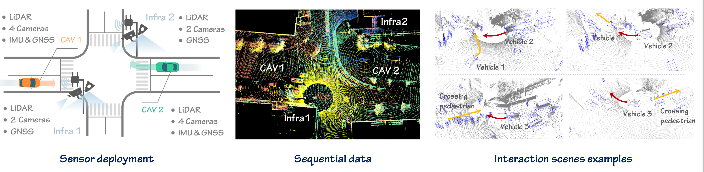

[//]: # ([![PWC]&#40;https://img.shields.io/endpoint.svg?url=https://paperswithcode.com/badge/v2x-vit-vehicle-to-everything-cooperative/3d-object-detection-on-v2xset&#41;]&#40;https://paperswithcode.com/sota/3d-object-detection-on-v2xset?p=v2x-vit-vehicle-to-everything-cooperative&#41;)

# V2XPnP: A Real-world Sequential Dataset and Fusion Pipeline for Perception and Prediction with Vehicle-to-Everything Communication

[//]: # ([![paper]&#40;https://img.shields.io/badge/arXiv-Paper-<COLOR>.svg&#41;]&#40;https://arxiv.org/abs/2203.10638&#41;)

V2XPnP is a large-scale V2X sequential dataset, focusing on the temporal tasks in vehicle-to-everything and supporting all V2X collaboration modes, ie, vehicle-to-vehicle (V2V), infrastructure-to-infrastructure (I2I), vehicle-centric (VC), and infrastructure-centric (IC). V2XPnP includes both perception data and sequential trajectories from over 68 vehicle-centric scenarios and 63 infrastructure-centric with a total of 32k frames.

## Release Plan
- **`2024/06/12`**: Sample Data of V2XPnP 
- **`2024/09/01`**: Whole V2XPnP Dataset
- **`2024/09/01`**: V2XPnP Codebase - Official Version 1.0

## Data
The sample data of V2XPnP can be accessed in [Google Drive](https://drive.google.com/drive/folders/1ZjVW-OKu-afIoiqfQJgFYwHOWzWE8_e8?usp=sharing), and we will release all the data later. The sequential perceptions data format follows the [OpenCOOD](https://opencood.readthedocs.io/en/latest/md_files/data_annotation_tutorial.html), and the trajectory dataset records the whole trajectory of each agent in each scenario.

## Benchmark Tasks
- End-to-end cooperative perception and prediction
- Cooperative temporal perception
- Cooperative prediction
- **`To be added`**

## License
All assets and code are under the [CC BY-NC-ND](https://creativecommons.org/licenses/by-nc-nd/4.0/) license unless specified otherwise.

## Acknowledgement
V2XPnP belongs to the [OpenCDA ecosystem](https://arxiv.org/abs/2301.07325) family, supported by [UCLA Mobility Lab](https://mobility-lab.seas.ucla.edu/). The dataset and codebase are built upon [V2X-Real](https://arxiv.org/abs/2403.16034) and [OpenCOOD](https://github.com/DerrickXuNu/OpenCOOD) in the OpenCDA ecosystem family.
